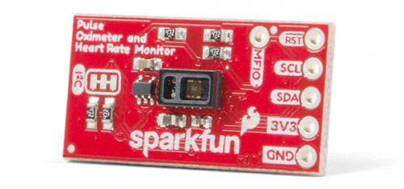
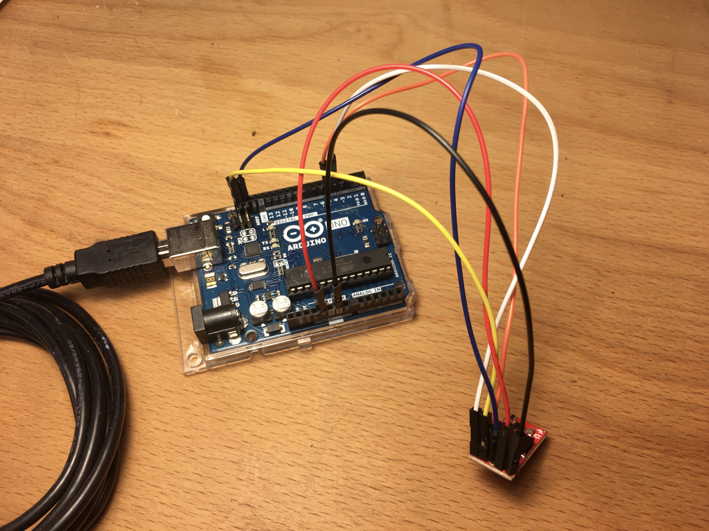
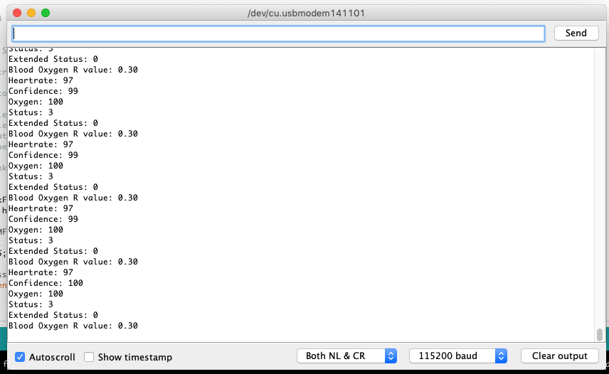

# Pulse oximeter and heart rate sensor tutorial

De MAX30101 in de [SparkFun Pulse Oximeter and Heart Rate Monitor](https://learn.sparkfun.com/tutorials/sparkfun-pulse-oximeter-and-heart-rate-monitor-hookup-guide) is een geïntegreerde pulsoximetrie- en hartslagmonitormodule. Het bevat interne LEDs, fotodetectors en optische elementen om de hartslag en zuurstof in het bloed te meten. Bloed dat verzadigd is met zuurstof absorbeert licht anders dan onverzadigd bloed. Een pulsoximeter meet hemoglobinemoleculen in bloed die verzadigd zijn met zuurstof. Bij een gezonde volwassene gaan deze waarden van 94% tot 100%.

## Hardware

Je hebt nodig:

* Arduino UNO en USB kabel
* SparkFun Pulse Oximeter and Heart Rate Monitor
* 6 male-male jumper kabeltjes

De sensor komt met een Qwiic kabel, die kan je niet direct aansluiten op een Arduino. Met jumper kabels kunnen we de Arduino verbinden met de sensor, door ze te solderen op de sensor en alsvolgt in te pluggen in de Arduino:

| Arduino | Kleur  | Sensor |
|---------|--------|------|
| GND     | Zwart  | GND  |
| 3V3     | Rood   | 3V3  |
| SDA     | Blauw  | SDA  |
| SCL     | Geel   | SCL  |
| 4       | Wit    | RST  |
| 5       | Oranje | MFIO |

## Software

Download de [ZIP file van de Arduino library](https://github.com/sparkfun/SparkFun_Bio_Sensor_Hub_Library/archive/master.zip) voor de sensor. 

Installeer de library in de [Arduino IDE](https://www.arduino.cc/en/Main/Software) onder `Tools > Manage Libraries`.

Open het bijgeleverde "BPM Mode 2" voorbeeld, je vindt het onder `File > Examples > SparkFun Bio Hub Sensor Library > Example2_config_BPM_Mode2`, en upload het naar de Arduino.

Open de monitor van de Arduino onder `Tools > Serial Monitor`. Zorg ervoor dat de baud rate zeker op 115200 staat, net zoals in de Arduino code. Als je de sensor op je vinger zet kan je je hartslag uitlezen:

## Status codes

De sensor geeft status codes terug om aan te geven of de sensor zijn metingen goed kan doen:

De status geeft weer of de sensor een object of vinger gedetecteerd heeft:

| Nummer | Status |
|--------|--------------|
| 0 | No object detected |
| 1 | Object detected |
| 2 | Object other than finger detected |
| 3 | Finger detected |

De extended status geeft meer details over de detectie:

| Nummer | Extended status |
|--------|--------------|
| 0 | Success |
| 1 | Not ready |
| -1 | Object detected |
| -2 | Excessive sensor device motion |
| -3 | No object detected |
| -4 | Pressing too hard |
| -5 | Object other than finger detected |
| -6 | Excessive finger motion |

## Moar

Meer details kan je lezen in de [tutorial van Sparkfun](https://learn.sparkfun.com/tutorials/sparkfun-pulse-oximeter-and-heart-rate-monitor-hookup-guide).